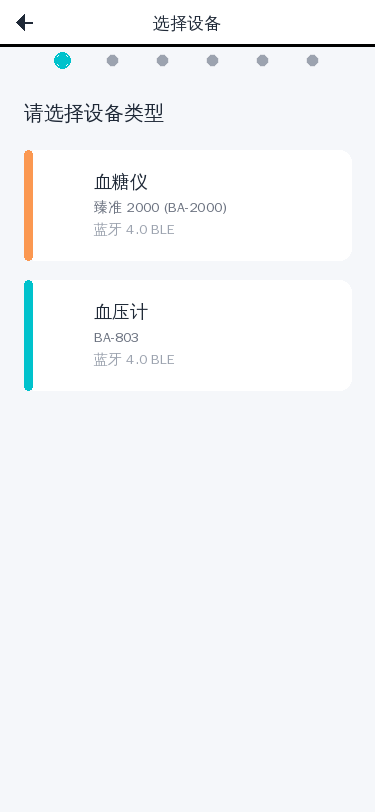

# 设备绑定功能需求文档 (PRD) - 图文版

**项目名称**: 三诺医疗设备蓝牙绑定功能  
**版本**: v1.0  
**最后更新**: 2026-03-03  
**文档状态**: 待研发  

---

## 一、项目概述

### 1.1 背景
为用户提供便捷的蓝牙医疗设备（血糖仪、血压计）绑定功能，实现设备与 APP 的快速配对和数据同步。

### 1.2 目标设备
| 设备类型 | 型号 | 连接方式 | 配套 APP |
|----------|------|----------|----------|
| 血糖仪 | 臻准 2000 (BA-2000) | 蓝牙 4.0 BLE | 三诺健康/诺安健康 |
| 血压计 | BA-803 | 蓝牙 4.0 BLE | 三诺健康 |

### 1.3 用户场景
- 用户首次购买三诺设备，需要通过 APP 绑定设备
- 用户更换手机后，需要重新绑定设备
- 用户绑定后可自动同步测量数据到 APP

---

## 二、功能流程总览

```
选择设备类型 → 操作指引 → 搜索设备 → 选择设备 → 配对确认 → 绑定成功
    (Step 1)      (Step 2)     (Step 3)     (Step 4)     (Step 5)     (Step 6)
```

**流程图示意**:
```
┌─────────────┐    ┌─────────────┐    ┌─────────────┐
│  Step 1     │    │  Step 2     │    │  Step 3     │
│ 选择设备类型 │ → │  操作指引   │ → │  搜索设备   │
│  (首页)     │    │  (图文说明) │    │  (动画)     │
└─────────────┘    └─────────────┘    └─────────────┘
                                              ↓
┌─────────────┐    ┌─────────────┐    ┌─────────────┐
│  Step 6     │ ←  │  Step 5     │ ←  │  Step 4     │
│  绑定成功   │    │  配对确认   │    │  选择设备   │
│  (完成)     │    │  (输入码)   │    │  (列表)     │
└─────────────┘    └─────────────┘    └─────────────┘
```

---

## 三、详细步骤说明

### Step 1: 选择设备类型

#### 界面预览
> **📸 截图位置**: 打开 `device_binding_demo.html` → 点击"设备绑定"按钮 → 截图整个页面
> 
> **截图建议**: 展示两个设备卡片（橙色血糖仪 + 青色血压计）

#### 页面元素
| 元素 | 描述 | 样式 |
|------|------|------|
| 导航栏 | 返回按钮 + 页面标题"选择设备" | 白色背景，固定顶部 |
| 进度条 | 6 个点，第 1 个高亮 | 青色高亮，灰色未激活 |
| 血糖仪卡片 | 橙色主题，显示设备图标和名称 | `#FB9851` 橙色渐变 |
| 血压计卡片 | 青色主题，显示设备图标和名称 | `#00C2CC` 青色渐变 |

#### 界面示意
```
┌────────────────────────────────────┐
│ ←      选择设备                    │ 导航栏
├────────────────────────────────────┤
│  ● ○ ○ ○ ○ ○                      │ 进度条
├────────────────────────────────────┤
│                                    │
│  ┌──────────────────────────────┐  │
│  │  🩸  血糖仪                  │  │
│  │  臻准 2000 (BA-2000)         │  │  血糖仪卡片
│  │  蓝牙 4.0 BLE                │  │  (橙色)
│  └──────────────────────────────┘  │
│                                    │
│  ┌──────────────────────────────┐  │
│  │  💙  血压计                  │  │
│  │  BA-803                      │  │  血压计卡片
│  │  蓝牙 4.0 BLE                │  │  (青色)
│  └──────────────────────────────┘  │
│                                    │
└────────────────────────────────────┘
```

#### 交互逻辑
- 点击设备卡片进入下一步
- 顶部导航栏支持返回
- 卡片有按压缩放效果 (scale: 0.98)

#### 技术要点
- 根据设备类型加载不同的操作指引
- 记录用户选择的设备型号

---

### Step 2: 操作指引

#### 界面预览
> **📸 截图位置**: 在 Step 1 页面点击任意设备卡片 → 截图指引页面
> 
> **截图建议**: 展示 4 步图文指引和底部"已阅读，开始绑定"按钮

#### 页面元素
| 元素 | 描述 |
|------|------|
| 导航栏 | 返回按钮 + 页面标题"操作指引" |
| 进度条 | 6 个点，第 2 个高亮 |
| 指引步骤 | 4 个步骤，每步含图标 + 文字说明 |
| 开始按钮 | 固定底部，"已阅读，开始绑定" |

#### 血糖仪指引内容
```
┌────────────────────────────────────┐
│ ←      操作指引                    │
├────────────────────────────────────┤
│  ○ ● ○ ○ ○ ○                      │
├────────────────────────────────────┤
│                                    │
│  步骤 1                            │
│  ┌──────────────────────────────┐  │
│  │  📦  安装试纸                │  │
│  │  安装试纸或长按开机键 3 秒开机  │  │
│  └──────────────────────────────┘  │
│                                    │
│  步骤 2                            │
│  ┌──────────────────────────────┐  │
│  │  💡  确认蓝牙图标           │  │
│  │  确认屏幕显示蓝牙图标       │  │
│  │  (闪烁表示可配对)            │  │
│  └──────────────────────────────┘  │
│                                    │
│  步骤 3                            │
│  ┌──────────────────────────────┐  │
│  │  ⚙️  进入蓝牙菜单           │  │
│  │  部分型号需进入"设置"→"蓝牙" │  │
│  └──────────────────────────────┘  │
│                                    │
│  步骤 4                            │
│  ┌──────────────────────────────┐  │
│  │  📱  保持距离               │  │
│  │  保持设备与手机距离 ≤ 1 米    │  │
│  └──────────────────────────────┘  │
│                                    │
├────────────────────────────────────┤
│     [已阅读，开始绑定]             │  固定底部按钮
└────────────────────────────────────┘
```

#### 血压计指引内容
```
步骤 1: 安装电池 (4 节 7 号电池) 或连接 USB 供电
步骤 2: 正确缠绕袖带
步骤 3: 长按电源键 3 秒开机，确认蓝牙图标显示
步骤 4: 部分型号需长按"记忆"键 5 秒进入配对模式
```

#### 技术要点
- 指引内容根据 Step 1 选择的设备类型动态加载
- 支持滑动查看指引步骤

---

### Step 3: 搜索设备

#### 界面预览
> **📸 截图位置**: 点击"已阅读，开始绑定"按钮 → 截图搜索动画页面
> 
> **截图建议**: 展示扩散圆环动画和"正在搜索设备..."文字

#### 页面元素
| 元素 | 描述 |
|------|------|
| 导航栏 | 返回按钮 + 页面标题"搜索设备" |
| 进度条 | 6 个点，第 3 个高亮 |
| 搜索动画 | 3 个扩散圆环（CSS 动画） |
| 状态文字 | "正在搜索设备..." |
| 超时提示 | 30 秒后显示"未找到设备" + 重试按钮 |

#### 界面示意
```
┌────────────────────────────────────┐
│ ←      搜索设备                    │
├────────────────────────────────────┤
│  ○ ○ ● ○ ○ ○                      │
├────────────────────────────────────┤
│                                    │
│           ╭─────╮                  │
│        ╭─────────╮                │  扩散圆环
│     ╭─────────────╮               │  (CSS 动画)
│        🔍                          │
│                                    │
│     正在搜索设备...                │
│                                    │
│     请确保设备已开启配对模式        │
│                                    │
└────────────────────────────────────┘
```

#### 交互逻辑
- 进入页面自动开始搜索
- 搜索超时 (30 秒) 显示"未找到设备"提示
- 提供"重试"按钮

#### 异常处理
| 异常场景 | 处理方式 |
|----------|----------|
| 蓝牙未开启 | 弹窗提示用户开启蓝牙 |
| 30 秒未找到设备 | 显示"未找到设备"，提供重试按钮 |
| 权限被拒绝 | 引导用户到系统设置开启蓝牙权限 |

---

### Step 4: 选择设备

#### 界面预览
> **📸 截图位置**: 搜索到设备后 → 截图设备列表页面
> 
> **截图建议**: 展示设备列表，包含设备名称和 MAC 地址

#### 页面元素
| 元素 | 描述 |
|------|------|
| 导航栏 | 返回按钮 + 页面标题"选择设备" |
| 进度条 | 6 个点，第 4 个高亮 |
| 设备列表 | 可多选一，显示设备名称和 MAC 地址 |
| 连接按钮 | 选中设备后可点击 |

#### 界面示意
```
┌────────────────────────────────────┐
│ ←      选择设备                    │
├────────────────────────────────────┤
│  ○ ○ ○ ● ○ ○                      │
├────────────────────────────────────┤
│                                    │
│  找到以下设备:                     │
│                                    │
│  ┌──────────────────────────────┐  │
│  │ ○ Sinocare_BA2000_7113      │  │
│  │   MAC: 00:1A:7D:DA:71:13    │  │  设备 1
│  └──────────────────────────────┘  │
│                                    │
│  ┌──────────────────────────────┐  │
│  │ ○ Sinocare_BA2000_8254      │  │
│  │   MAC: 00:1A:7D:DA:82:54    │  │  设备 2
│  └──────────────────────────────┘  │
│                                    │
├────────────────────────────────────┤
│        [连接设备] (选中后可用)      │
└────────────────────────────────────┘
```

#### 设备名称格式
- 血糖仪：`Sinocare_BA2000_XXXX` 或 `SN-XXXX`
- 血压计：`Sinocare_BA803_XXXX` 或 `BP-XXXX`
- `XXXX` = MAC 地址后 4 位

#### 交互逻辑
- 点击设备卡片选中 (高亮边框 + 背景色)
- 选中后"连接设备"按钮可点击
- 支持重新选择

#### 技术要点
- 显示设备广播名称 (含 MAC 后 4 位便于用户识别)
- 支持多设备同时广播时的列表展示
- 按信号强度排序 (内部逻辑，不展示给用户)

---

### Step 5: 配对确认

#### 界面预览
> **📸 截图位置**: 点击"连接设备"后 → 截图配对确认页面
> 
> **截图建议**: 展示配对码输入框或动态配对码显示

#### 页面元素
| 元素 | 描述 |
|------|------|
| 导航栏 | 返回按钮 + 页面标题"配对确认" |
| 进度条 | 6 个点，第 5 个高亮 |
| 配对码显示 | 动态配对码时显示 6 位数字 |
| 输入框 | 固定配对码时提供输入框 |
| 确认按钮 | "确认配对" |

#### 配对模式说明

| 配对模式 | 说明 | 界面表现 |
|----------|------|----------|
| 无需配对码 | 部分新型号设备 | 直接显示"正在配对"，自动完成 |
| 固定配对码 | 老款设备 | 提示用户输入 `000000` 或 `123456` |
| 动态配对码 | 部分型号 | 显示设备屏幕上的 6 位数字 |

#### 界面示意 (动态配对码)
```
┌────────────────────────────────────┐
│ ←      配对确认                    │
├────────────────────────────────────┤
│  ○ ○ ○ ○ ● ○                      │
├────────────────────────────────────┤
│                                    │
│  请在设备上确认以下配对码:         │
│                                    │
│  ┌──────────────────────────────┐  │
│  │                              │  │
│  │       4 8 2 7 1 5            │  │  配对码
│  │                              │  │
│  └──────────────────────────────┘  │
│                                    │
│  请确认设备屏幕显示的数字一致       │
│                                    │
├────────────────────────────────────┤
│        [确认配对]                  │
└────────────────────────────────────┘
```

#### 界面示意 (固定配对码输入)
```
┌────────────────────────────────────┐
│ ←      配对确认                    │
├────────────────────────────────────┤
│  ○ ○ ○ ○ ● ○                      │
├────────────────────────────────────┤
│                                    │
│  请输入配对码:                     │
│                                    │
│  ┌──────────────────────────────┐  │
│  │  [______]                    │  │  输入框
│  └──────────────────────────────┘  │
│                                    │
│  默认配对码：000000 或 123456      │
│                                    │
├────────────────────────────────────┤
│        [确认配对]                  │
└────────────────────────────────────┘
```

#### 异常处理
| 异常场景 | 提示信息 |
|----------|----------|
| 配对码错误 | "配对码错误，请确认设备屏幕显示的数字" |
| 配对超时 | "配对超时，请确保设备处于待机状态后重试" |
| 连接断开 | "连接断开，请检查设备电量" |

---

### Step 6: 绑定成功

#### 界面预览
> **📸 截图位置**: 配对成功后 → 截图成功页面
> 
> **截图建议**: 展示成功图标、设备信息卡片和"完成"按钮

#### 页面元素
| 元素 | 描述 |
|------|------|
| 导航栏 | 页面标题"绑定成功" |
| 进度条 | 6 个点，全部高亮 |
| 成功图标 | 青色对勾动画 |
| 成功文字 | "绑定成功!" |
| 设备信息卡片 | 显示已绑定设备信息 |
| 完成按钮 | 返回设备管理页面 |

#### 界面示意
```
┌────────────────────────────────────┐
│        绑定成功                    │
├────────────────────────────────────┤
│  ● ● ● ● ● ●                      │
├────────────────────────────────────┤
│                                    │
│           ✓                        │  成功图标
│        (青色对勾)                  │  (动画)
│                                    │
│       绑定成功!                    │
│                                    │
│  ┌──────────────────────────────┐  │
│  │  血糖仪 · 臻准 2000          │  │
│  │  MAC: 00:1A:7D:DA:71:13      │  │  设备信息
│  │  绑定时间：2026-03-03 15:30  │  │
│  └──────────────────────────────┘  │
│                                    │
├────────────────────────────────────┤
│           [完成]                   │
└────────────────────────────────────┘
```

#### 交互逻辑
- 显示绑定成功状态
- 点击"完成"返回设备管理页面
- 自动保存设备信息到本地存储

#### 技术要点
- 保存设备 MAC 地址、型号、绑定时间
- 标记设备为"已绑定"状态
- 支持后续自动重连

---

## 四、技术规格

### 4.1 蓝牙技术要求
- **协议**: Bluetooth 4.0 BLE (低功耗蓝牙)
- **广播间隔**: 20ms - 500ms (设备端配置)
- **配对距离**: ≤ 1 米 (建议)
- **连接超时**: 30 秒 (搜索) / 60 秒 (配对)

### 4.2 设备广播数据
```
广播包内容:
- Local Name: Sinocare_BA2000_XXXX / Sinocare_BA803_XXXX
- Service UUID: (根据设备类型)
- Manufacturer Data: (可选，包含设备型号信息)
```

### 4.3 API 接口需求

#### 4.3.1 蓝牙扫描接口
```javascript
// 输入
{
  deviceType: "glucose" | "bp",  // 设备类型
  timeout: 30000                  // 超时时间 (ms)
}

// 输出
{
  success: boolean,
  devices: [
    {
      name: string,        // 设备广播名称
      mac: string,         // MAC 地址
      rssi: number,        // 信号强度
      deviceType: string   // 设备类型标识
    }
  ],
  errorCode?: string,      // 错误码 (失败时)
  errorMessage?: string    // 错误信息 (失败时)
}
```

#### 4.3.2 蓝牙配对接口
```javascript
// 输入
{
  mac: string,             // 设备 MAC 地址
  pairingCode?: string,    // 配对码 (可选)
  timeout: 60000           // 超时时间 (ms)
}

// 输出
{
  success: boolean,
  pairingMode: "none" | "fixed" | "dynamic",  // 配对模式
  errorCode?: string,
  errorMessage?: string
}
```

#### 4.3.3 设备绑定保存接口
```javascript
// 输入
{
  mac: string,
  deviceType: string,
  deviceModel: string,
  bindTime: number         // 时间戳
}

// 输出
{
  success: boolean,
  deviceId: string         // 绑定后的设备 ID
}
```

### 4.4 状态码定义
| 状态码 | 说明 |
|--------|------|
| SUCCESS | 操作成功 |
| BLUETOOTH_OFF | 蓝牙未开启 |
| PERMISSION_DENIED | 权限被拒绝 |
| SEARCH_TIMEOUT | 搜索超时 |
| PAIRING_TIMEOUT | 配对超时 |
| PAIRING_CODE_ERROR | 配对码错误 |
| CONNECTION_FAILED | 连接失败 |
| DEVICE_NOT_FOUND | 设备未找到 |

---

## 五、UI/UX 规范

### 5.1 设计规范
| 颜色用途 | 色值 | 说明 |
|----------|------|------|
| 主色调 | `#00C2CC` | 青色，用于血压计主题 |
| 血糖仪主题色 | `#FB9851` | 橙色 |
| 血压计主题色 | `#00C2CC` | 青色 |
| 成功色 | `#00C2CC` | 与主色调一致 |
| 错误色 | `#F04838` | 红色 |
| 警告色 | `#FB7A1E` | 橙色 |

### 5.2 交互规范
- **点击反馈**: 按压缩放效果 (scale: 0.98)
- **加载动画**: 扩散圆环动画
- **成功状态**: 对勾图标 + 绿色提示
- **错误状态**: 红色提示 + 重试按钮

### 5.3 页面结构
```
┌────────────────────────────────────┐
│ 导航栏 (固定顶部)                  │
│ ├── 返回按钮                       │
│ ├── 页面标题                       │
│ └── 占位 (保持标题居中)            │
├────────────────────────────────────┤
│ 内容区                             │
│ ├── 进度条 (6 个点)                 │
│ ├── 页面标题                       │
│ ├── 页面描述                       │
│ ├── 主要内容 (根据步骤变化)        │
│ └── 操作按钮 (固定底部)            │
└────────────────────────────────────┘
```

---

## 六、异常处理

### 6.1 异常场景汇总
| 场景 | 触发条件 | 处理方式 |
|------|----------|----------|
| 蓝牙未开启 | 系统蓝牙关闭 | 弹窗提示 + 跳转设置 |
| 权限被拒绝 | 蓝牙权限未授予 | 引导用户到系统设置 |
| 搜索超时 | 30 秒未找到设备 | 显示提示 + 重试按钮 |
| 配对失败 | 配对码错误或超时 | 显示错误原因 + 重试 |
| 连接断开 | 蓝牙连接意外断开 | 提示检查电量 + 重试 |
| 设备电量低 | 设备低电量状态 | 低电量警告提示 |

### 6.2 错误提示文案
| 错误类型 | 提示文案 |
|----------|----------|
| 蓝牙未开启 | "请先开启手机蓝牙" |
| 权限被拒绝 | "请在系统设置中允许使用蓝牙" |
| 搜索超时 | "未找到设备，请确认设备已开启配对模式后重试" |
| 配对失败 | "配对失败，请确认配对码正确" |
| 连接断开 | "连接断开，请检查设备电量后重试" |

---

## 七、测试要求

### 7.1 功能测试
- [ ] 血糖仪完整绑定流程
- [ ] 血压计完整绑定流程
- [ ] 搜索超时处理
- [ ] 配对码验证 (固定/动态/无需)
- [ ] 绑定成功后设备列表展示
- [ ] 已绑定设备自动重连

### 7.2 兼容性测试
- [ ] iOS 12+ 系统
- [ ] Android 8+ 系统
- [ ] 不同屏幕尺寸适配
- [ ] 深色模式适配 (可选)

### 7.3 设备兼容性测试
- [ ] BA-2000 血糖仪 (各固件版本)
- [ ] BA-803 血压计 (各固件版本)
- [ ] 多设备同时广播场景
- [ ] 低电量场景

---

## 八、交付物

### 8.1 前端交付
- [ ] 完整 HTML/CSS/JS 原型 (参考 `device_binding_demo.html`)
- [ ] 6 个页面的完整交互逻辑
- [ ] 响应式适配 (移动端)
- [ ] 加载动画和过渡效果

### 8.2 接口文档
- [ ] 蓝牙扫描 API 文档
- [ ] 蓝牙配对 API 文档
- [ ] 设备绑定保存 API 文档
- [ ] 错误码定义文档

### 8.3 测试报告
- [ ] 功能测试报告
- [ ] 兼容性测试报告
- [ ] 设备兼容性测试报告

---

## 九、附录

### 9.1 参考资料
- 调研报告：`device_binding_research.md`
- HTML 原型：`device_binding_demo.html`
- 三诺官网：https://www.sinocare.com
- 蓝牙规范：Bluetooth Core Specification v5.0

### 9.2 术语表
| 术语 | 说明 |
|------|------|
| BLE | Bluetooth Low Energy，低功耗蓝牙 |
| 广播 | 设备发送广播包，让手机可以发现 |
| 配对 | 建立安全连接的过程 |
| 绑定 | 保存配对信息，实现自动重连 |
| RSSI | 接收信号强度指示 |

### 9.3 变更记录
| 版本 | 日期 | 变更内容 | 作者 |
|------|------|----------|------|
| v1.0 | 2026-03-03 | 初始版本 | - |
| v1.1 | 2026-03-03 | 添加图文版，包含界面示意和截图占位符 | - |

---

## 📸 截图指南

### 如何替换截图

1. **打开 HTML 原型**
   ```bash
   # 在浏览器中打开
   open device_binding_demo.html
   # 或
   xdg-open device_binding_demo.html
   ```

2. **按步骤截图**
   - Step 1: 选择设备类型页面
   - Step 2: 操作指引页面 (血糖仪和血压计各一张)
   - Step 3: 搜索设备页面 (动画状态)
   - Step 4: 选择设备页面 (设备列表)
   - Step 5: 配对确认页面 (配对码显示)
   - Step 6: 绑定成功页面

3. **替换占位符**
   - 将截图保存到 `screenshots/` 目录
   - 使用 Markdown 图片语法替换示意框:
     ```markdown
     
     ```

### 建议的截图尺寸
- 移动端尺寸：375x812 (iPhone X) 或 360x640 (Android)
- 格式：PNG (支持透明背景)
- 命名：`step{N}_{description}.png`

---

**文档结束**

> **备注**: 
> 1. 具体绑定流程可能因设备固件版本不同而有差异，建议以实际设备说明书为准
> 2. 开发前请确认目标设备的蓝牙协议细节
> 3. 配对码机制需要与设备端固件团队确认
